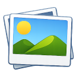

# Yaga — Photo Gallery

A fast, clean photo and video gallery for Linux desktops, built with GTK 4 and libadwaita.



---

## Screenshots


---

## What is Yaga?

Yaga is a gallery app that feels at home on a modern GNOME desktop. It scans your media folders, keeps everything snappy with a thumbnail cache and a SQLite index, and stays out of your way.

---

## Highlights

- **Multiple libraries** — separate tabs for Photos, Pictures, Videos, Screenshots, and any extra folders you add
- **Nextcloud sync** — browse your Nextcloud photo library directly, no FUSE or GVFS mount needed; thumbnails load on demand
- **Date grouping** — sort by date and photos are grouped under clear section headers (day / week / month / year)
- **Built-in editor** — crop, rotate, adjust brightness / contrast / colour channels, add frames for holidays and occasions, drop stickers
- **QR code scanner** — scan Nextcloud app-password QR codes straight from the camera to connect your account instantly
- **Video playback** — watch videos directly in the app or hand them off to any external player
- **Pull-to-refresh** — scroll past the top to kick off a re-scan, just like on a phone
- **Selection mode** — long-press any photo to enter multi-select, then delete or move a whole batch at once
- **Folder view** — drill into subfolders; folder tiles show a 2×2 preview mosaic
- **Share & open externally** — send a photo by e-mail or open it in any other app with one tap
- **Light / dark / system theme** — follows your desktop or lets you override it
- **English & German UI** — switches at runtime without restarting

---

## Install & Run

**One-time install** — adds a launcher and a desktop entry, no root required:
```bash
bash install.sh
```
Then launch **Yaga** from your app menu, or type `yaga` in a terminal.

**Run directly without installing:**
```bash
python3 -m yaga
```

**Uninstall:**
```bash
bash uninstall.sh
```

---

## Nextcloud Setup

1. Open **Settings → Nextcloud**
2. Enter your server URL and username
3. Either paste an app password or tap **Scan QR code** — go to *Nextcloud → Settings → Security → App passwords*, create one, and scan the QR code with your camera
4. Hit **Connect**

Photos are streamed directly over WebDAV. Thumbnails are cached locally; full files are only downloaded when you open them.
